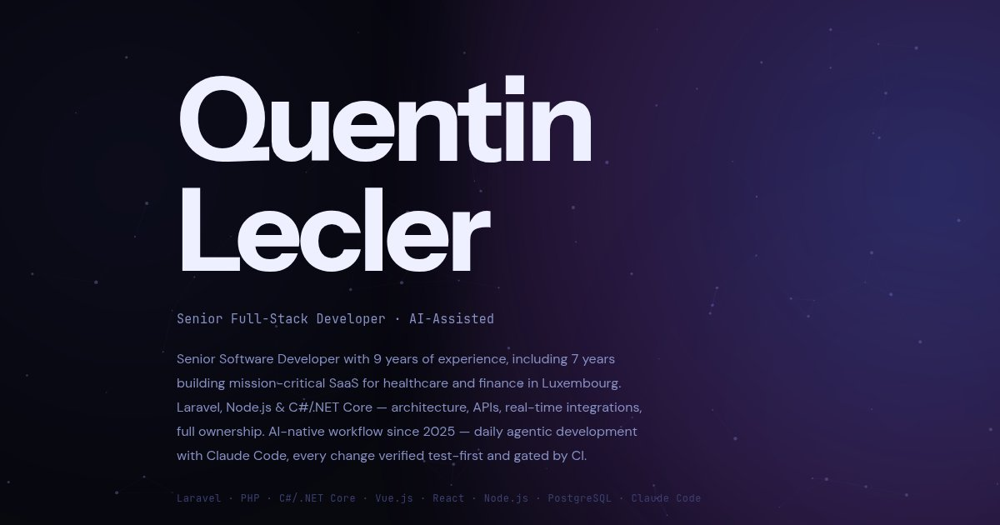

# Quentin Lecler — Portfolio

[](https://lecler.dev)

**[lecler.dev](https://lecler.dev)** — personal portfolio / business card for Quentin Lecler, Senior Full-Stack Developer.

## Stack

Zero framework, zero build step, zero third-party CDN. Everything lives in one hand-written `index.html`:

- Vanilla HTML/CSS/JS — no React, no bundler, no runtime dependency
- Self-hosted fonts (Instrument Sans, DM Sans, JetBrains Mono) and icons
- Canvas-based particle field + per-element cursor-tracked hover halo, all vanilla JS
- Contact form posts to [Formspree](https://formspree.io) via `fetch()`, protected by reCAPTCHA Enterprise + Formshield
- Dark/light theme with no flash-of-wrong-theme on load

Deployed on [GitHub Pages](https://pages.github.com/) with a custom domain (`CNAME`). Push to `main` → live, no CI pipeline.

## Local development

```bash
python3 -m http.server 8080
```

Then open `http://localhost:8080`. See `CLAUDE.md` for the full architecture breakdown.

## Testing

`package.json` only holds **dev dependencies for testing** (`@playwright/cli`, browser automation / visual checks) — the site itself never uses `node_modules`.

```bash
npm install
PLAYWRIGHT_BROWSERS_PATH=0 npx --no-install playwright-cli install-browser chrome-for-testing
```
