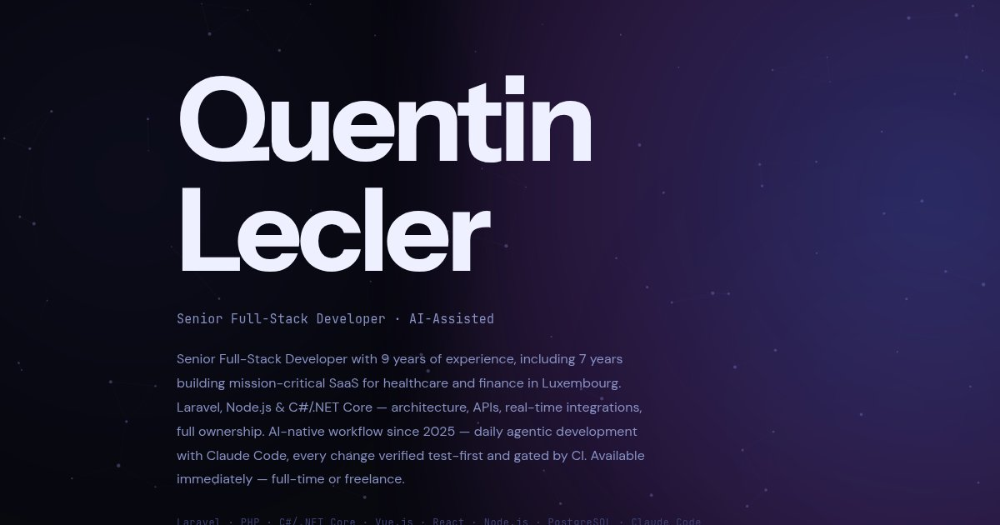

# Quentin Lecler — Portfolio

[](https://lecler.dev)

**[lecler.dev](https://lecler.dev)** — personal portfolio / business card for Quentin Lecler, Senior Full-Stack Developer.

## Stack

Zero framework, zero build step, zero third-party CDN. One hand-written `index.html`, bilingual (EN/FR):

- Vanilla HTML/CSS/JS — no React, no bundler
- Translations with [i18next](https://www.i18next.com/) (`i18n/en.json`, `i18n/fr.json`), vendored in `vendor/` — language from `?lang=`, saved choice or browser, FR/EN switch in the nav
- Self-hosted fonts (Instrument Sans, DM Sans, JetBrains Mono) and icons
- Canvas-based particle field + per-element cursor-tracked hover halo, all vanilla JS
- Contact form posts to [Formspree](https://formspree.io) via `fetch()`, protected by reCAPTCHA Enterprise + Formshield
- Dark/light theme with no flash-of-wrong-theme on load

Deployed on [GitHub Pages](https://pages.github.com/) with a custom domain (`CNAME`). Push to `main` → GitHub Actions runs the unit and end-to-end tests, then deploys; a failing test means no deployment.

## Local development

```bash
python3 -m http.server 8080
```

Then open `http://localhost:8080`. See `CLAUDE.md` for the full architecture breakdown.

## Testing

```bash
npm install          # also enables the pre-push hook (git config core.hooksPath .githooks)
PLAYWRIGHT_BROWSERS_PATH=0 npx --no-install playwright-cli install-browser chrome-for-testing
npm run test:unit    # vitest: translations, markup, content rules, i18n loader, theme
npm run test:e2e     # Playwright: language, theme, layout (no overflow), real scroll + burger menu on phones
```

After changing i18next's version: `npm run vendor` copies its browser builds into `vendor/` (committed, GitHub Pages doesn't run npm). `node_modules/` is never served.
